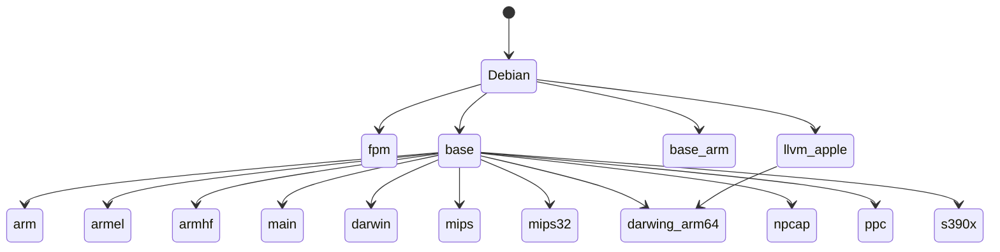

|                   | main | 1.24 |
|-------------------|------|-|
| golang-crossbuild |[](https://buildkite.com/elastic/golang-crossbuild/builds?branch=main)|[](https://buildkite.com/elastic/golang-crossbuild/builds?branch=1.24)|
| llvm-apple        |[](https://buildkite.com/elastic/llvm-apple/builds?branch=main)|[](https://buildkite.com/elastic/llvm-apple/builds?branch=1.24)|
| fpm               |[](https://buildkite.com/elastic/fpm/builds?branch=main)|[](https://buildkite.com/elastic/fpm/builds?branch=1.24)|


# golang-crossbuild Docker images

This repository contains Dockerfiles for cross building Go binaries for various platforms.
The aim is to provide a simple way to build Go binaries for multiple platforms without having to install and configure cross compilers on your host machine.
To do that the project provides a set of Docker images that can be used to build Go binaries for the following platforms:

* linux/amd64
* linux/arm
* linux/armel
* linux/armhf
* linux/arm64
* linux/mips
* linux/mipsle
* linux/mips64
* linux/ppc64
* linux/ppc64le
* linux/s390x
* windows/amd64
* darwin/amd64
* darwin/arm64

The Docker images are based on Debian and the cross compilers are installed using the crossbuild-essential package.
Each architecture has its own folder with the files needed to build the Docker image for that architecture.
Each architecture has its own Dockerfile to build a Docker image for that architecture.
Each architecture Dockerfile installs the crossbuild-essential package for that architecture and the libraries needed to build our binaries.
These Dockerfiles are generated files from `Dockerfile.tmpl` template file that is in the architectures folder.
This template is processed using a Makefile that is in the architectures folder.
Each architecture folder has a `roofs` folder that contains the files that will be copied to the Docker image in the root folder.
In `rootfs` we have the `compolers.yml` file that contains the list of compilers that will be installed in the Docker image.
Each Docker image has a basic compilation test that is executed when the image is built. This test uses `rootfs/helloworld.c` file to compile a simple C program and verify the architecture of the result binary.
The compiler used to build the binaries is LLVM.
Some of the Docker images are build for the amd64 and arm64 architectures, this allow to run the Docker images in linux/amd64, linux/arm64, darwin/amd64, and darwin/arm64. This is done using the `.buildkite/scripts/buildx.sh` command.

The Docker images are tagged using the following format:

* `docker.elastic.co/beats-dev/golang-crossbuild:<go-version>-<arch>-<debian-version>`

For the latest version of the images based on the latest Debian and Go versions, the following tag is also used:

* `docker.elastic.co/beats-dev/golang-crossbuild:<go-version>-<arch>`

## Build tags

The tags match with the Golang version, and for each supported version there is a release in https://github.com/elastic/golang-crossbuild/releases.

Replace `<GOLANG_VERSION>` with the version you would like to use, for instance: `1.17.1`

- `docker.elastic.co/beats-dev/golang-crossbuild:<GOLANG_VERSION>-arm` - linux/arm64
- `docker.elastic.co/beats-dev/golang-crossbuild:<GOLANG_VERSION>-armel` - linux/armv5, linux/armv6
- `docker.elastic.co/beats-dev/golang-crossbuild:<GOLANG_VERSION>-armhf` - linux/armv7
- `docker.elastic.co/beats-dev/golang-crossbuild:<GOLANG_VERSION>-base`
- `docker.elastic.co/beats-dev/golang-crossbuild:<GOLANG_VERSION>-darwin` - darwin/amd64 (MacOS 10.11, MacOS 10.14)
- `docker.elastic.co/beats-dev/golang-crossbuild:<GOLANG_VERSION>-main` - linux/i386, linux/amd64, windows/amd64
- `docker.elastic.co/beats-dev/golang-crossbuild:<GOLANG_VERSION>-main-debian7` - linux/i386, linux/amd64, windows/amd64
- `docker.elastic.co/beats-dev/golang-crossbuild:<GOLANG_VERSION>-main-debian8` - linux/i386, linux/amd64, windows/amd64
- `docker.elastic.co/beats-dev/golang-crossbuild:<GOLANG_VERSION>-main-debian9` - linux/i386, linux/amd64, windows/amd64
- `docker.elastic.co/beats-dev/golang-crossbuild:<GOLANG_VERSION>-main-debian10` - linux/i386, linux/amd64, windows/amd64
- `docker.elastic.co/beats-dev/golang-crossbuild:<GOLANG_VERSION>-main-debian11` - linux/i386, linux/amd64, windows/amd64
- `docker.elastic.co/beats-dev/golang-crossbuild:<GOLANG_VERSION>-main-debian12` - linux/i386, linux/amd64, windows/amd64
- `docker.elastic.co/beats-dev/golang-crossbuild:<GOLANG_VERSION>-mips-debian11` - linux/mips64, linux/mips64el
- `docker.elastic.co/beats-dev/golang-crossbuild:<GOLANG_VERSION>-mips-debian12` - linux/mips64, linux/mips64el
- `docker.elastic.co/beats-dev/golang-crossbuild:<GOLANG_VERSION>-mips32` - linux/mips, linux/mipsle **NOTE**: it does not exist from Golang versions > `1.18.5`/`1.17.12`.
- `docker.elastic.co/beats-dev/golang-crossbuild:<GOLANG_VERSION>-ppc-debian12` - linux/ppc64, linux/ppc64le
- `docker.elastic.co/beats-dev/golang-crossbuild:<GOLANG_VERSION>-s390x-debian11` - linux/s390x
- `docker.elastic.co/beats-dev/golang-crossbuild:<GOLANG_VERSION>-s390x-debian12` - linux/s390x

### glibc

* **Debian7** uses `glibc 2.13` so the resulting binaries (if dynamically linked) have greater compatibility.
* **Debian8** uses `glibc 2.19`.
* **Debian9** uses `glibc 2.24`.
* **Debian10** uses `glibc 2.28`.
* **Debian11** uses `glibc 2.31`.

## Old Build Tags

Until Golang version 1.15

| Description | Tags for 1.10 | Tags for 1.11 | Tags for 1.12 | Tags for 1.13 | Tags for 1.14 | Tags for 1.15 |
| ------------- | -----| ------- | ----- |  ------ |  ------ |  ------ |
| linux/{amd64,386} and windows/{amd64,386} | `1.10.8-main` | `1.11.13-main` | `1.12.12-main` |  `1.13.12-main` | `1.14.15-main` | `1.15.14-main` |
| linux/{armv5,armv6,armv7} | `1.10.8-arm` | `1.11.13-arm` | `1.12.12-arm` | `1.13.12-arm` | `1.14.15-arm` | `1.15.14-arm` |
| linux/arm64 | **See above** | **See above** | **See above** | **See above** | **See above** | **See above** |
| linux/{armv5,armv6} | **See above** | **See above** | **See above** | **See above** | **See above** | **See above** |
| linux/{armv7} | **See above** | **See above** | **See above** | **See above** | **See above** | **See above** |
| darwin/{386} | `1.10.8-darwin` | `1.11.13-darwin` | `1.12.12-darwin` | `1.13.12-darwin` | `1.14.15-darwin` | `1.15.14-darwin` |
| darwin/{amd64} | `1.10.8-darwin` | `1.11.13-darwin` | `1.12.12-darwin` | `1.13.12-darwin` | `1.14.15-darwin` | `1.15.14-darwin` |
| linux/{ppc64,ppc64le} | `1.10.8-ppc` | `1.11.13-ppc` | `1.12.12-ppc` | `1.13.12-ppc` | `1.14.15-ppc` | `1.15.14-ppc` |
| linux/{mips,mipsle,mips64,mips64le} | `1.10.8-mips` | `1.11.13-mips` | `1.12.12-mips` | `1.13.12-mips` | `1.14.15-mips` |
| linux/{mips64,mips64le} | **See above** | **See above** | **See above** | **See above** | **See above** | **See above** |
| linux/{mips,mipsle} | **See above** | **See above** | **See above** | **See above** | **See above** | **See above** |
| linux/s390x | `1.10.8-s390x` | `1.11.13-s390x` | `1.12.12-s390` | `1.13.12-s390` | `1.14.15-s390` | `1.15.14-s390` |
| linux/{amd64,386} and windows/{amd64,386} (Debian 7 (see **below**)) |`1.10.8-main-debian7` | `1.11.13-main-debian7` | `1.12.12-main-debian7` | `1.13.12-main-debian7` | `1.14.15-main-debian7` | `1.15.14-main-debian7` |
| linux/{amd64,386} and windows/{amd64,386} (Debian 8 (see **below**)) | `1.10.8-main-debian8` | `1.11.13-main-debian8` | `1.12.12-main-debian8` | `1.13.12-debian8` | `1.14.15-main-debian8` | `1.15.14-main-debian8` |
| linux/{amd64,386} and windows/{amd64,386} (Debian 9 (see **below**)) | NA | NA | NA | NA | NA | `1.15.14-main-debian9` |
| linux/{amd64,386} and windows/{amd64,386} (Debian 10 (see **below**)) | NA | NA | NA | NA | NA | `1.15.14-main-debian10` |
| linux/arm64 (Debian 9 (see **below**)) | NA | NA | NA | NA | NA | `1.15.14-base-arm-debian9` |

### glibc

* **Debian7** uses `glibc 2.13` so the resulting binaries (if dynamically linked) have greater compatibility.
* **Debian8** uses `glibc 2.19`.
* **Debian9** uses `glibc 2.24`.
* **Debian10** uses `glibc 2.28`.

## Makefiles

There are several Makefiles in the profect across the different folders.
The Makefile in the root folder is used to build the Docker images for the different architectures,
it triggers the build of all Docker images for all architectures and Debian versions supported.

The file `go/Makefile.common` is the default Makefile used to build the Docker images for the different architectures.
There is additional Makefile for each Debian version that is used to build the Docker images for that Debian version.

* `go/Makefile.debian7`
* `go/Makefile.debian8`
* `go/Makefile.debian9`
* `go/Makefile.debian10`
* `go/Makefile.debian11`

No all architectures are supported in all Debian versions, so the Makefile for each Debian version will only build the Docker images for the architectures that are supported in that Debian version.

On the Makefiles there are some variables to define the name of the Docker image, the version of the Docker image, the Debian version, and the suffix to use in the tag of the Docker image.

```make
NAME           := golang-crossbuild
VERSION        := 1.20.2
DEBIAN_VERSION ?= 9
SUFFIX         := -$(shell basename $(CURDIR))
TAG_EXTENSION  ?=

export DEBIAN_VERSION TAG_EXTENSION

DOCKER_CMD := docker build
```

In this example the name of the Docker image is `golang-crossbuild`, the go version is `1.20.2` that is uses as part of the tag, the Debian version is `9`, the suffix is `-debian9`, and the tag extension is empty. Also the `DOCKER_CMD` variable is used to define the command to use to build the Docker image, in this case `docker build`.

The tag is build using the following format:

```make
TAG := $(REPOSITORY)/$(NAME):$(VERSION)$(SUFFIX)$(TAG_EXTENSION)
```

The common variables to all the Makefiles are defined at `Makefile.common` file.

To more information about the supported architextures and the correlation with comercial names,
you can check the [Debian Supported Architectures](https://wiki.debian.org/SupportedArchitectures) page.

To make and push the Docker images for all the architectures and default Debian version, you can run the following command:

```shell
make build push
```

To make and push the Docker images for all the architectures and Debian 10, you can run the following command:

```shell
make -C go -f Makefile.debian10 build push
```

Finally, to build a single Docker image for `arm` architecture and Debian 10, you can run the following command:

```shell
make -C go -f Makefile.debian10 build push IMAGES=arm
```

## Multiarch Docker images

Some of the Docker images are built for the amd64 and arm64 architectures, this allow to run the Docker images in linux/amd64, linux/arm64, darwin/amd64, and darwin/arm64. This is done using the `.buildkite/scripts/buildx.sh` command.
To choose if build a Docker image for amd64 and arm64 or only for amd64, The Makefiles check fot the value o `BUILDX` and `DOCKER_MULTIARCH` variables. In the target Makefile the `DOCKER_COMMAND` is replaced with the `.buildkite/scripts/buildx.sh` command.

```make
ifeq ($(DOCKER_MULTIARCH),1)
DOCKER_CMD := $(SELF_DIR)/../.buildkite/scripts/buildx.sh
endif
```

## Docker images dependencies

The Docker images depends on each other, so there is an order to build them.
The are two Docker images that are parent of all the other images, the `fpm` and the `go/llvm-apple`.
Anytime a new Debian version is released, the `fpm` and `go/llvm-apple` image needs to be updated to use the new Debian version.
The following diagram shows the dependencies between the Docker images.



## Releasing images for a new Go version

With every new version of `go` we made a new branch with the name of the previous version to allow us to continue building the Docker images for the previous version of `go`. So if we are in go `1.21` and go `1.22` is released, we create a new branch `1.21`, then we update the `main` branch to install go `1.22` as explained in the below steps:

1. Update the Go version in [.go-version](https://github.com/elastic/golang-crossbuild/blob/main/.go-version).
1. Update the Docker tag in
   [Makefile.common](https://github.com/elastic/golang-crossbuild/blob/main/go/Makefile.common#L5).
1. Run `.github/updatecli.d/bump-go-release-version.sh "$(cat .go-version)"`
1. Update the versions listed in this README.md.
1. Update the `go-minor` value in [bump-golang.yml](https://github.com/elastic/golang-crossbuild/blob/main/github/workflows/bump-golang.yml) with the new minor go version, i.e: `1.22`.
1. Update the `go-minor` and `branch` values in [bump-golang-previous.yml](https://github.com/elastic/golang-crossbuild/blob/main/github/workflows/bump-golang-previous.yml) with the old minor go version, i.e: `1.21`.
1. Add an entry in the `.mergify.yml` file to support the label backport for `backport-v1.x-1`, i.e: `backport-v1.21`.
1. Create the GitHub label backport for `backport-v1.x-1` in https://github.com/elastic/golang-crossbuild/labels, i.e: `backport-v1.21`.
1. Commit the changes. `git add -u && git commit -m 'Update to Go 1.x.y'`.
1. Create a Pull Request with the description `'Update to Go 1.x.y'`.
1. When merging the PR, the automation will release those docker images.

**NOTE**: Due to the changes in the Debian packages repositories, there are no guarantees that the Docker images for the previous version of `go` will continue to work after some time.

## FIPS Build

[Makefile.common](./go/Makefile.common) has an env var that can be used to create a FIPS compliant golang-crossbuild image:
```make
FIPS           ?=
```

When this var is set to `"true"` the [microsoft/go](https://github.com/microsoft/go) will be used instead of the regular upstream go release.
Additionally the docker image will have the env vars `CGO_ENABLED=1` and `GOEXPERIMENT=systemcrypto` set to ensure binaries built within the crossbuild image are FIPS compliant by default.

## Packaging MacOS SDK

The osxcross repository used to cross compile for MacOSX has [instructions for packaging the SDK](https://github.com/tpoechtrager/osxcross#packaging-the-sdk).

The instructions for packaging the SDK on a Linux instance are:

1. Clone the [osxcross](https://github.com/tpoechtrager/osxcross) repo.
1. Install `clang`, `make`, `libssl-dev`, `lzma-dev`, `libxml2-dev`, `libbz2-dev`.
1. Download [Xcode from Apple](Download Xcode: https://developer.apple.com/download/more]).
1. Run `./tools/gen_sdk_package_pbzx.sh <xcode>.xip`.

## Usage Example

```shell
docker run -it --rm \
  -v $GOPATH/src/github.com/user/go-project:/go/src/github.com/user/go-project \
  -w /go/src/github.com/user/go-project \
  -e CGO_ENABLED=1 \
  docker.elastic.co/beats-dev/golang-crossbuild:1.16.7-armhf \
  --build-cmd "make build" \
  -p "linux/armv7"
```

This will execute your projects `make build` target. While executing the build
command the following variables with be added to the environment: GOOS, GOARCH,
GOARM, PLATFORM_ID, CC, and CXX.

## fpm Docker image

This Docker image install the [fpm](https://github.com/jordansissel/fpm) tool that is used to build packages.

## go/llvm-apple Docker image

The LLVM compiler present in Debian does not support arm64e architecture, so we need to build our own LLVM compiler to support this architecture.
The llvm-apple Docker image is based on [Apple LLVM fork](https://github.com/apple/llvm-project) and [osxcross](https://codeload.github.com/tpoechtrager/osxcross). The image build the LLVM compiler and configure the image to be able to cross compile for MacOSX.

LLVM need a SDK for macOS, the MacOSX-SDK used in the Docker image must be genarated from a MacOSX machine.
For the instructions to package the MacOS SDK see the [Packaging MacOS SDK](#packaging-macos-sdk) section.

## go/base Docker image

This Docker image is the base image for all the other Docker images, it contains the base packages fro cross compilation.
It is build for amd64 and arm64 architectures for Debian 9+.
In the folder you can find the `sources.list` file that contains the list of repositories to use to install the packages,
this file is different for each Debian version. In some cases, this file must point to `http://archive.debian.org/debian` instead of `http://deb.debian.org/debian` to be able to install the packages, this happens when the Debian version reach the end of life.

The base image is the one that install the `go` compiler, and the build tools for the rest of Docker images.
When a new version of go is released, the aDockerimage.tmpla files must be updated to install the new version.

## go/base-arm Docker image

The `base-arm` image is the base image to crossbuild `linux/arm64` binaries on `arm` hosts, it is build for Debian 7+.
This image is user to crosscompile in `linux/arm`.
It was replaced by the `base` image for Debian 9+ when we started to build multiarchitecture Docker images.
It could be removed in the future, it allow to `crosscompile` arm binaries in `linux/arm64` machines, that it is not needed because the native architecture is the same than the target architecture.
It was added to golang-crossbuild due limitations of the build system.

## go/main Docker image

The `main` image is the base image for the `amd64` architecture, it is build for Debian 7+.
It is used to cross compile for `linux/amd`, `linux/amd64`, `win/amd`, and `win/amd64`.
This Docker immage add two libraries to the `base` image, `libpcap` and `WpdPack` to be able to capture network packages on diferent OS.
Thes two libraries are precompiled and stored at https://storage.googleapis.com/golang-crossbuild-ci-internal/sdks.

## go/darwin Docker image

The `darwin` image is the base image for the MacOSX cross compilation, it is build for Debian 8+.
It can compiles for `darwin/amd` (Debian 10+), `darwin/amd64`, `darwin/arm64`, `darwin/arm64e`, and universal binaries.
This Docker image is based on the `base` image.
It uses [osxcross](https://codeload.github.com/tpoechtrager/osxcross) to configure the crosscompile for MacOSX.
This image require a MacOSX SDK to be installed in the Docker image,
for the instructions to package the MacOS SDK see the [Packaging MacOS SDK](#packaging-macos-sdk) section.

## go/darwin-arm64 Docker image

The `darwin-arm64` image is the base image for the MacOSX cross compilation, it is build for Debian 10+.
It can compiles for `darwin/amd64`, `darwin/arm64`, and `darwin/arm64e`, and universal binaries.
This Docker image is based on the `base` image.
It uses the `llvm-apple` image to cross compile for MacOSX.
The `darwin-arm64` can replace the `darwin` image in the future, it is faster to build and it does not need to build [osxcross](https://codeload.github.com/tpoechtrager/osxcross) and uses the official LLVM fork from Apple so it support enhacement for `darwin` architectures.

## go/arm Docker image

The `arm` image is the base image for the `arm64` architecture, it is build for Debian 9+.
It is used to cross compile for `linux/arm64`. This Docker image is based on the `base` image.

## go/armel Docker image

The `armel` image is the base image for the `armel` architecture, it is build for Debian 12+.
It is used to cross compile for `linux/armel`. This Docker image is based on the `base` image.

## go/armhf Docker image

The `armhf` image is the base image for the `armhf` architecture, it is build for Debian 9+.
It is used to cross compile for `linux/armhf`. This Docker image is based on the `base` image.

## go/mips Docker image

The `mips` image is the base image for the `mips` architecture, it is build for Debian 12+.
It is used to cross compile for `linux/mips`. This Docker image is based on the `base` image.

## go/mips32 Docker image

The `mips32` image is the base image for the `mips32` architecture, it is build for Debian 11+.
It is used to cross compile for `linux/mips32`. This Docker image is based on the `base` image.

## go/ppc Docker image

The `ppc` image is the base image for the `ppc` architecture, it is build for Debian 12+.
It is used to cross compile for `linux/ppc`. This Docker image is based on the `base` image.

## go/s390x Docker image

The `s390x` image is the base image for the `s390x` architecture, it is build for Debian 12+.
It is used to cross compile for `linux/s390x`. This Docker image is based on the `base` image.

## go/npcap Docker image

The `npcap` image is a placeholder for the `npcap` library, see [npcap](./NPCAP.md) for more information.

## Troubleshooting

### bzip2 issues

If the `gen_sdk_package_pbza.sh` script gives an error that reads:

```shell
Error while extracting archive:(Metadata): bzip2 support not compiled in. (Success)
```

A manual work-around is needed in order to create the SDK (other people have reported that installing `libbz2-dev` fixed this issue).

First edit `osxcross/tools/tools.sh` to remove the `trap` line from the `create_tmp_dir` function (currently line 264).

Then re-run  `./tools/gen_sdk_package_pbzx.sh <xcode>.xip`.

Go to the tmp dir created in the build dir: `cd osxcross/build/tmp_<X>`.

Then run:

```shell
../../target/SDK/tools/bin/pbzx -n Content | cpio -i
cd ../..
XCODEDIR=osxcross/build/tmp_<X> ./tools/gen_sdk_package.sh
```

The SDK should be in the working directory.
The tmp dir can be safely deleted after this.

The SDKs should be uploaded into the `gs://golang-crossbuild-ci-internal/sdks` bucket on GCP (Google Cloud Platform).
This is accessible to authorized users in the `elastic-observability-ci` project [here](https://console.cloud.google.com/storage/browser/golang-crossbuild-ci-internal/sdks).
